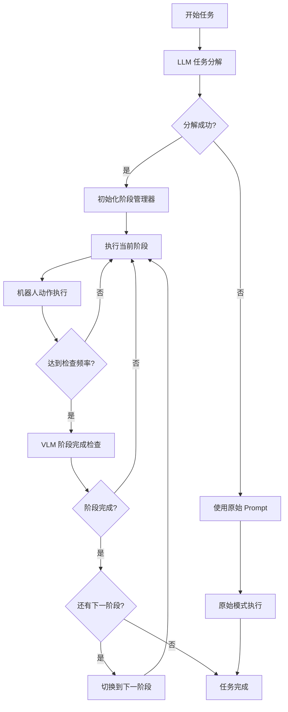

# 阶段式任务执行系统使用指南

## 🎯 功能概述

本系统使用 **LLM 进行任务分解** 和 **VLM 进行阶段完成判断**，将复杂的机器人操作任务自动分解为多个简单阶段，并动态判断每个阶段的完成情况。

### 核心特性

1. **自动任务分解**：使用 DeepSeek LLM 将复杂任务分解为多个简单阶段
2. **智能阶段判断**：使用 Qwen-VL-Max 根据多相机观察判断阶段完成状态
3. **动态 Prompt 切换**：根据当前阶段自动切换执行指令
4. **详细执行日志**：记录每个阶段的执行时长、置信度等信息

---

## 📦 安装依赖

```bash
pip install requests pillow pyyaml
```

---

## 🔑 配置 API Keys

### 方法 1：环境变量（推荐）

```bash
# DeepSeek API (用于任务分解)
export DEEPSEEK_API_KEY="your_deepseek_api_key_here"

# Qwen-VL API (用于阶段判断，推荐)
export DASHSCOPE_API_KEY="your_dashscope_api_key_here"

# 或者使用 OpenAI GPT-4o
export OPENAI_API_KEY="your_openai_api_key_here"
```

### 方法 2：配置文件

编辑 `evaluation/robotwin/stage_config.yaml`：

```yaml
llm:
  api_key: "sk-xxxxxxxxxxxxx"  # DeepSeek API Key

vlm:
  api_key: "sk-xxxxxxxxxxxxx"  # Qwen/OpenAI API Key
  model: "qwen-vl-max"  # 或 "gpt-4o"
```

---

## 🚀 使用方法

### 基本用法

```bash
# 启用阶段式执行
python evaluation/robotwin/eval_polict_client_openpi.py \
  --config your_config.yaml \
  --enable_stage_based \
  --port 8000
```

### 完整示例

```bash
python evaluation/robotwin/eval_polict_client_openpi.py \
  --config ./configs/robotwin_eval.yaml \
  --enable_stage_based \
  --stage_config_path ./evaluation/robotwin/stage_config.yaml \
  --port 8000 \
  --test_num 10 \
  --save_root results/stage_based_eval
```

### 禁用阶段式执行（使用原始模式）

```bash
# 不添加 --enable_stage_based 标志即可
python evaluation/robotwin/eval_polict_client_openpi.py \
  --config your_config.yaml \
  --port 8000
```

---

## ⚙️ 配置参数说明

### `stage_config.yaml` 配置项

```yaml
# LLM 配置（任务分解）
llm:
  provider: "deepseek"
  api_key: "YOUR_API_KEY"  # 或从环境变量读取
  base_url: "https://api.deepseek.com/v1"
  model: "deepseek-chat"

# VLM 配置（阶段判断）
vlm:
  provider: "qwen"  # 可选: qwen, openai, deepseek
  api_key: "YOUR_API_KEY"
  base_url: "https://dashscope.aliyuncs.com/compatible-mode/v1"
  model: "qwen-vl-max"  # 推荐使用 qwen-vl-max

# 阶段管理配置
stage_manager:
  max_stages: 5  # 最大阶段数
  completion_threshold: 0.7  # 置信度阈值 (0.0-1.0)
  check_frequency: 5  # 每执行 N 步检查一次阶段完成
```

### 命令行参数

| 参数 | 类型 | 默认值 | 说明 |
|------|------|--------|------|
| `--enable_stage_based` | flag | False | 启用阶段式执行 |
| `--stage_config_path` | str | `./evaluation/robotwin/stage_config.yaml` | 阶段配置文件路径 |
| `--port` | int | 8000 | WebSocket 端口 |
| `--test_num` | int | 100 | 测试次数 |
| `--save_root` | str | `results/default_vis_path` | 结果保存路径 |

---

## 📊 输出结果

### 1. 阶段执行摘要 (JSON)

保存在：`{save_root}/stseed-{seed}/visualization/{task_name}/{episode}_stage_summary.json`

```json
{
  "total_stages": 4,
  "current_stage": 5,
  "completed_stages": 4,
  "progress_percentage": 100.0,
  "history": [
    {
      "stage_id": 1,
      "prompt": "Move gripper above the green bottle",
      "reasoning": "Gripper is positioned directly above the green bottle",
      "confidence": 0.92
    },
    ...
  ]
}
```

### 2. 可视化视频

- **标准输出**：包含所有阶段的完整执行视频
- **文件名格式**：`{episode}_{prompt}_{success}.mp4`

### 3. 控制台日志

```
🚀 STAGE-BASED EXECUTION MODE ENABLED
============================================================
✓ Stage-based system initialized successfully

[StageManager] Initialized with 4 stages
  Stage 1: Move gripper above the green bottle
  Stage 2: Grasp the green bottle
  Stage 3: Move the bottle to above the blue plate
  Stage 4: Place the bottle on the blue plate

[StageManager] ═══ Advancing to Stage 1/4 ═══
  Goal: Move gripper above the green bottle
  Success Criteria: Gripper is positioned directly above the green bottle within 5cm

step: 0
  [Stage 1/4]: Move gripper above the green bottle

  🔍 Checking stage 1 completion...
[StageCompletionChecker] Stage 1: ✓ COMPLETED (confidence: 0.92)
  Reasoning: The gripper is clearly visible above the green bottle...
  Duration: 15 steps

[StageManager] ═══ Advancing to Stage 2/4 ═══
  Goal: Grasp the green bottle
  ...
```

---

## 🎯 工作流程



---

## 📝 任务分解示例

### 输入任务

```
"Use the left arm to briefly touch the green bottle, then use the right arm to pick up the same green bottle."
```

### LLM 分解结果

```json
{
  "stages": [
    {
      "stage_id": 1,
      "prompt": "Move left gripper to touch the green bottle",
      "description": "Navigate the left robot arm to briefly make contact with the green bottle",
      "success_criteria": "Left gripper has touched the green bottle surface"
    },
    {
      "stage_id": 2,
      "prompt": "Retract left arm to safe position",
      "description": "Move the left arm away from the bottle after touching",
      "success_criteria": "Left arm is away from the bottle and in a safe position"
    },
    {
      "stage_id": 3,
      "prompt": "Move right gripper above the green bottle",
      "description": "Navigate the right robot arm to position above the green bottle",
      "success_criteria": "Right gripper is positioned directly above the green bottle"
    },
    {
      "stage_id": 4,
      "prompt": "Grasp the green bottle with right gripper",
      "description": "Lower the right gripper and close it around the bottle",
      "success_criteria": "Right gripper is closed and the bottle is lifted"
    }
  ]
}
```

---

## 🔍 VLM 阶段判断示例

### 输入

- **当前阶段目标**：`"Move right gripper above the green bottle"`
- **成功标准**：`"Right gripper is positioned directly above the green bottle"`
- **多相机观察**：
  - Top-down view (cam_high)
  - Left wrist view (cam_left_wrist)
  - Right wrist view (cam_right_wrist)

### VLM 输出

```json
{
  "completed": true,
  "reasoning": "Based on the top-down view, the right gripper is clearly positioned directly above the green bottle. The gripper's center aligns with the bottle's center, and the distance appears to be within 5cm. The bottle is clearly visible and unobstructed.",
  "confidence": 0.92,
  "observations": {
    "key_objects_visible": ["green bottle", "right gripper", "table"],
    "robot_state": "Right gripper open and positioned above bottle",
    "scene_state": "Bottle is stationary on the table surface"
  }
}
```

---

## 🛠️ 故障排除

### 问题 1: `Stage-based system initialization failed`

**可能原因**：
- API Key 未设置或无效
- 网络连接问题

**解决方案**：
```bash
# 检查环境变量
echo $DEEPSEEK_API_KEY
echo $DASHSCOPE_API_KEY

# 测试 API 连接
python -c "from stage_manager import TaskDecomposer; td = TaskDecomposer('your_key'); print(td.decompose_task('test task'))"
```

### 问题 2: `Stage decomposition failed`

**可能原因**：
- LLM API 响应格式错误
- 任务描述过于复杂或模糊

**解决方案**：
- 系统会自动回退到原始模式（不使用阶段分解）
- 检查日志中的详细错误信息

### 问题 3: VLM 判断始终返回未完成

**可能原因**：
- `completion_threshold` 设置过高
- 成功标准定义不清晰

**解决方案**：
```yaml
# 降低置信度阈值
stage_manager:
  completion_threshold: 0.6  # 从 0.7 降低到 0.6
  check_frequency: 3  # 增加检查频率
```

---

## 🎓 最佳实践

### 1. 选择合适的 VLM

- **推荐使用 Qwen-VL-Max**：性价比高，准确度好，延迟低
- **高精度场景使用 GPT-4o**：更高的准确度，但成本更高

### 2. 调整检查频率

```yaml
stage_manager:
  check_frequency: 5  # 快速任务可以设置为 3-5
                      # 慢速任务可以设置为 10-15
```

### 3. 合理设置置信度阈值

```yaml
stage_manager:
  completion_threshold: 0.7  # 保守：0.8-0.9
                             # 平衡：0.6-0.7
                             # 激进：0.5-0.6
```

### 4. 任务描述规范

✅ **好的任务描述**：
```
"Use the left arm to pick up the red cup from the table and place it on the blue plate"
```

❌ **不好的任务描述**：
```
"Do something with the cup"  # 太模糊
```

---

## 📚 API 文档

### TaskDecomposer

```python
from stage_manager import TaskDecomposer

decomposer = TaskDecomposer(
    api_key="your_deepseek_key",
    base_url="https://api.deepseek.com/v1",
    model="deepseek-chat"
)

stages = decomposer.decompose_task(
    complex_prompt="Pick up the bottle",
    max_stages=5
)
```

### StageCompletionChecker

```python
from stage_manager import StageCompletionChecker

checker = StageCompletionChecker(
    api_key="your_vlm_key",
    base_url="https://dashscope.aliyuncs.com/compatible-mode/v1",
    model="qwen-vl-max"
)

is_completed, reasoning, confidence = checker.check_stage_completion(
    obs=observation_dict,
    stage_info=current_stage
)
```

### StageManager

```python
from stage_manager import StageManager

manager = StageManager(
    stages=decomposed_stages,
    completion_threshold=0.7
)

current_prompt = manager.get_current_prompt()
if manager.has_next_stage():
    manager.advance_to_next_stage()
```

---

## 📞 联系方式

如有问题或建议，请联系：genghaotian

---

## 📄 许可证

此项目遵循原项目的许可证。
